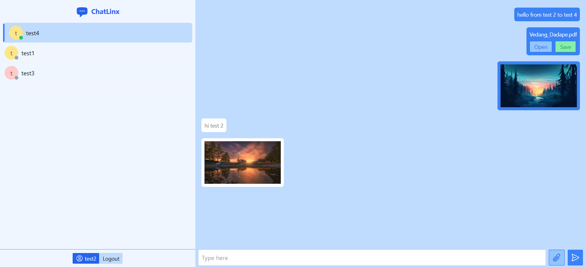

# ChatLinx

## Screenshots

<p align="center">
  <br><br>
  <br>
  <strong><em>User Conversation and Messaging Interface</em></strong>
</p>

## Project Overview

### Architecture

#### Frontend (Client-side)
- Built using React.js for messaging UI.
- Features user login, profile viewing, user list display, and real-time messaging through WebSockets.

#### Backend (Server-side)
- Utilizes Express.js for HTTP request handling and endpoint management.
- MongoDB stores user information and messages; JWT ensures secure user authentication.

### Backend Functionalities

#### User Authentication
- Registration with unique username/password, securely hashed using bcrypt.
- JWT-based login generates tokens for subsequent authenticated requests.

#### Messaging Features
- Fetches messages between users and facilitates real-time communication via WebSockets.

#### User Management
- Profile retrieval based on JWT; displays a list of registered users for messaging.

### Websockets Implementation

- WebSocketServer (ws library) manages connections for real-time communication.
- Notifies clients about online users' presence and updates dynamically.

## Installation and Setup

### Prerequisites
- Node.js with npm installed
- MongoDB installed and running

1. **Clone the repository** using ``git clone https://github.com/Vedang12d/chat-app.git``

2. **Navigate to the server directory** and **Install dependencies** using `npm install`.

3. **Create a .env file** in the server directory. Add these environment variables:

```bash
MONGO_URL=YOUR_MONGO_DB_CONNECTION_STRING
JWT_SECRET=YOUR_JWT_SECRET_KEY
CLIENT_URL='http://localhost:3000' (or your frontend URL)
```

4. **Run the server** using the appropriate command.

5. Navigate to the client directory and **install client dependencies** using `npm install`.

6. **Start the React app** using the appropriate command.

7. Access the application in your browser at `http://localhost:3000`.
